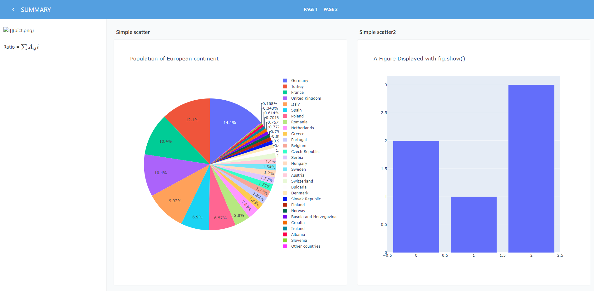

This repo contains a toy example on how to create a jupyter flex notebook from python.
After compilation, an html flex dashboard report is created.


``` python
# download librairies
pip install -r requirements.txt

# make flex notebook + compile the html report
python make_flex_notebook.py

# os system command already called in the python script and added here for information
# make flex dashboard html report
# jupyter nbconvert --to flex REPORT_SUMMARY.ipynb --execute
```



